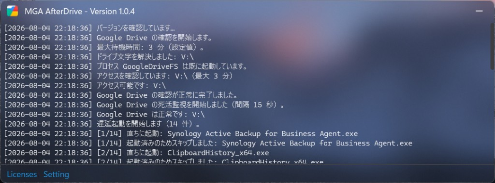
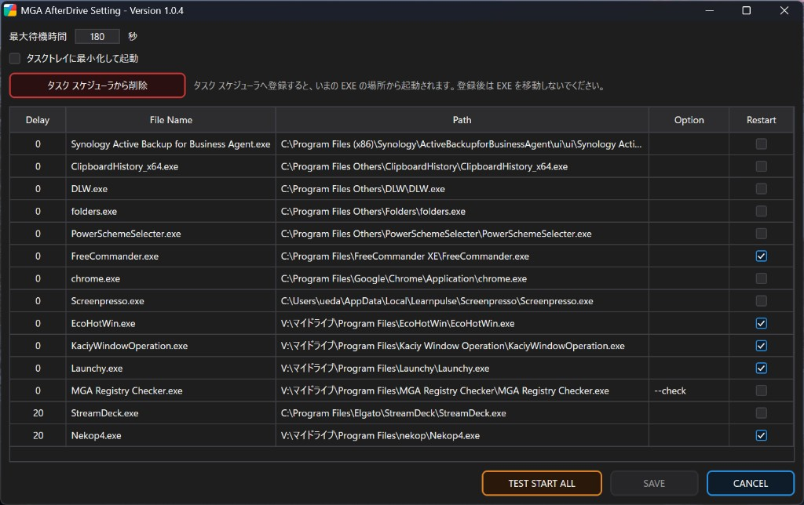

# MGA AfterDrive

ログオン時にタスク スケジューラから起動し、登録したアプリを遅延起動する Windows 用ユーティリティです。Setting から本アプリ自体をタスク スケジューラへ登録し、そこから各アプリを順に起動します。

Google Drive for desktop の準備完了を待ってから起動できるほか、Drive 切断時には対象アプリを強制終了し、復帰後に再起動できます。

| 名称 | 説明 |
|------|------|
| **MGA AfterDrive** | メインアプリ（監視・遅延起動・トレイ常駐） |
| **MGA AfterDrive Setting** | 起動エントリと共通設定の編集、タスク スケジューラ登録 |

現在のバージョン: **1.0.2**

## スクリーンショット

### メイン画面

Google Drive の準備完了を待ったあと、登録アプリを順次起動する様子です。



### Setting

起動エントリの Delay / Path / Restart や、最大待機時間・タスク スケジューラ登録を編集します。



## 特色

### ログオン時の遅延起動

スタートアップで同時に起動するアプリが増えると、起動に失敗するものや、起動はしていてもタスクトレイにアイコンが出ないものが出てくることがあります。本アプリは **ユーザーのログオン時にタスク スケジューラから起動**し、Setting に登録したアプリを Delay 付きで順次起動することで、こうした不具合を抑えられます。

Setting の「タスク スケジューラに登録」で、ログオン時起動タスク（名前: `MGA AfterDrive`）を作成できます。登録すると、その時点の EXE の場所から起動されるため、登録後は EXE を移動しないでください。

### 本アプリ自体の配置

**本アプリ（`MGA-AfterDrive.exe`）はローカルディスク上に置いて起動してください。** Google Drive 上からの起動は想定していません。登録するアプリを Drive 上に置くのは問題ありませんが、AfterDrive 本体はローカルに置いたままにしてください。

### 登録するアプリの選び方

Setting には、スタートアップ項目をすべて移す必要はありません。次のようなものに絞って登録してください。

- OS のスタートアップではうまく起動しないもの
- Google Drive 上から起動するもの
- Google Drive 切断時に不具合が起きることが分かっているもの

アプリによっては、起動のたびにスタートアップへショートカットを作り直すものがあります。そうしたアプリを本アプリにも登録したままスタートアップ側のショートカットを残すと、意図せず二重起動することがあります。スタートアップ側は削除するか無効にし、本アプリ側だけで起動するようにしてください。

### Google Drive 上のアプリとの併用

非インストール型のアプリを Google Drive 上に置き、複数 PC から同じ設定で起動する使い方もあります。便利な一方で、Drive の準備が終わる前にスタートアップが走ると起動に失敗したり、Drive が一時切断されたときにアプリが不正終了したり、ハングに近い状態になったりすることがあります。

本アプリは次のように対処します。

- Google Drive のプロセスとマウント先の準備完了を待ってから、登録アプリを起動する
- Drive 切断を検知したら、Restart 対象のアプリを強制終了する
- Drive 復旧後に、そのアプリを再起動する

## 主な機能

- Google Drive プロセス（`GoogleDriveFS`）とマウント先へのアクセス確認
- エントリごとの Delay（秒）に従った順次起動（起動済みプロセスはスキップ）
- Restart チェックで切断時の強制終了・復帰時の再起動を指定（Google Drive 上のアプリは自動で ON）
- Setting 表示中はカウントダウンを一時停止。Delay を変更して保存した場合は、再開時にタイマーを再設定
- タスクトレイ常駐、起動時のトレイ格納オプション、二重起動防止
- Setting からのタスク スケジューラ登録／削除（ログオン時起動）
- 起動時に GitHub の最新リリースを確認し、新しいバージョンがあればログ表示とダイアログで通知（自動更新なし。必要ならリリースページを開く）
- ダークテーマ UI（DPI 対応）

## 動作環境

- Windows 10 / 11
- [.NET 8 Desktop Runtime](https://dotnet.microsoft.com/download/dotnet/8.0)（フレームワーク依存の単一 EXE）
- [Google Drive for desktop](https://www.google.com/drive/download/)

## 使い方

1. `MGA-AfterDrive.exe` を起動します。初回（設定未作成時）は Setting が開きます。
2. Setting で「タスク スケジューラに登録」を実行し、ログオン時に本アプリが起動するようにします。
3. Setting に実行ファイル（`.exe` / `.bat` / `.cmd` / `.com`）をドラッグ＆ドロップで追加します。
4. 各行の **Delay**（秒）や起動引数（**Option**）を編集し、**Save** します。
5. メインアプリが Google Drive の準備完了後、登録順（Delay 順）にアプリを起動します。

**Restart** にチェックを入れると、Google Drive 切断時に強制終了し、復帰後に再起動します。パスが Google Drive マウント配下のときは自動でオンになります（手動のオンオフも可能です）。

トレイアイコンから Setting を開き直せます。

## 設定の保存場所

```
%LocalAppData%\MGA\MGA AfterDrive\
  delay-entries.json   … 起動エントリ
  settings.json        … 最大待機時間・トレイ起動など
  app\                 … 公開版で展開される Setting（自動）
```

## 開発ビルド

```powershell
dotnet build src\MGA-AfterDrive\MGA-AfterDrive.csproj -c Debug
```

出力先の例:

```
src\MGA-AfterDrive\bin\Debug\net8.0-windows\
```

メイン EXE と同じフォルダに Setting もコピーされます。

## リリース（単一 EXE）

配布物は **`MGA-AfterDrive.exe` のみ**です。Setting は EXE 内に埋め込まれ、初回起動時に `%LocalAppData%\MGA\MGA AfterDrive\app\` へ展開されます。

```powershell
.\publish.ps1
```

または:

```powershell
dotnet publish src\MGA-AfterDrive\MGA-AfterDrive.csproj `
  -c Release -r win-x64 --self-contained false `
  -p:PublishSingleFile=true -o publish
```

出力: `publish\MGA-AfterDrive.exe`

完全オフライン配布にする場合は `--self-contained true` を付けてください（ファイルサイズが増えます）。

## ライセンス

このソフトウェアは [MIT License](LICENSE) の下で提供されます。

Copyright (c) 2026 MIYABI GAME AUDIO INC.

サードパーティ由来の表記は [THIRD_PARTY_NOTICES.md](THIRD_PARTY_NOTICES.md) を参照してください。
